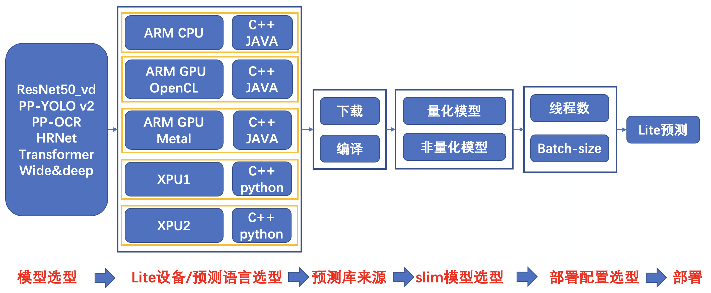
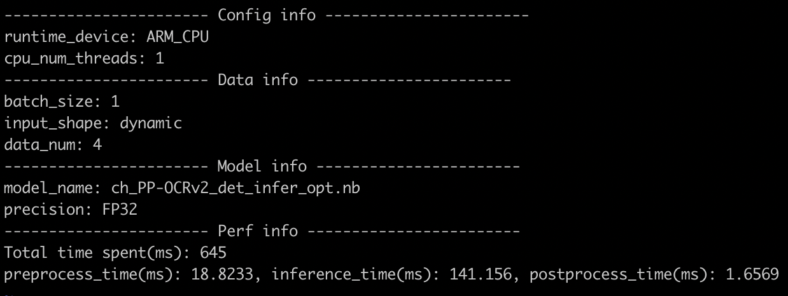

# ARM CPU 部署测试开发规范

- [1.概述](#概述)
- [2.总览](#总览)
    - [2.1 训推一体自动化测试](#训推一体自动化测试)
    - [2.2 文本检测样板间概览](#文本检测样板间概览)
- [3.Lite端ARM_CPU预测接入TIPC流程](#Lite端ARM_CPU预测接入TIPC流程)
    - [3.1 准备数据和环境](#准备数据和环境)
    - [3.2 规范化输出预测日志](#规范化输出预测日志)
        - [3.2.1 日志规范](#日志规范)
        - [3.2.2 接入步骤](#接入步骤)
    - [3.3 编写自动化测试代码](#编写自动化测试代码)
- [4.附录](#附录)
    - [4.1 自动化测试脚本test_arm_cpp.sh函数介绍](#自动化测试脚本函数介绍)
    - [4.2 注意事项](#注意事项)

<a name="概述"></a>
# 1.概述

训推一体认证（TIPC）旨在监控框架代码更新可能导致的模型训练、预测报错、性能下降等问题。本文主要介绍TIPC中基于ARM_CPU设备的Lite预测cpp测试的接入规范和监测点，是在基础测试上针对Lite测试的补充说明。

主要监控的内容有：

- 飞桨框架更新后，代码仓库模型基于ARM_CPU的Lite预测cpp测试是否能正常走通；（比如API的不兼容升级）

- 飞桨框架更新后，代码仓库模型基于ARM_CPU的的Lite预测cpp测试速度是否合理；

为了能监控上述问题，希望把代码仓库模型的Lite预测测试加到飞桨框架的CI和CE中，提升PR合入的质量。因此，需要在代码仓库中加入运行脚本（不影响套件正常运行），完成模型的自动化测试。

可以建立的CI/CE机制包括：

**全量数据走通开源模型Lite预测，并验证模型预测速度和精度是否符合设定预期；（单模型30分钟内)**

    a. 保证预测结果正确，预测速度符合预期（QA添加中）

**注:** 由于CI有时间限制，所以在测试的时候需要限制运行时间，所以需要构建一个很小的数据集完成测试。

<a name="总览"></a>
# 2.总览

<a name="训推一体自动化测试"></a>
## 2.1 训推一体自动化测试

本规范最终的测试的链条如下，可以根据模型开发规范和代码仓库需要，适当删减链条。

上图所示为Lite端的链条，共288条。其中，本文档主要介绍其中基于ARM_CPU的cpp测试链条。

<a name="文本检测样板间概览"></a>
## 2.2 文本检测样板间概览

在PaddleOCR中，以文本检测为例，提供了本规范的样板间，可以完成概述部分提到的1种CI/CE机制。

Lite预测测试工具位于PaddleOCR dygraph分支下的test_tipc目录，与Lite预测ARM_CPU样板间相关的主要文件如下：

```
test_tipc/
├── common_func.sh
├── configs # 配置文件目录
│   ├── ch_PP-OCRv2_det
│   │   ├── model_linux_gpu_normal_normal_lite_cpp_arm_cpu.txt
│   │   ├── ...
│   ├── ...
│   ├── ch_PP-OCRv2
│   │   ├── model_linux_gpu_normal_normal_lite_cpp_arm_cpu.txt
│   │   └── ...
├── prepare_lite_cpp.sh # 完成test_lite_**.sh运行所需要的数据和模型下载
├── test_lite_arm_cpp.sh # lite测试主程序
```

不同代码仓库的`configs`目录下的内容可根据实际情况进行调整, 配置文件`model_linux_gpu_normal_normal_lite_cpp_arm_cpu.txt`需满足[TIPC配置文件命名规范](https://github.com/PaddlePaddle/PaddleOCR/tree/dygraph/test_tipc#%E9%85%8D%E7%BD%AE%E6%96%87%E4%BB%B6%E5%91%BD%E5%90%8D%E8%A7%84%E8%8C%83)。

<a name="Lite端ARM_CPU预测接入TIPC流程"></a>
# 3.Lite端ARM_CPU预测接入TIPC流程

Lite端ARM_CPU预测接入TIPC包含如下三个步骤，接下来将依次介绍这三个部分。

- 准备数据和环境
- 规范化输出预测日志
- 编写自动化测试代码

<a name="准备数据和环境"></a>  
## 3.1 准备数据和环境

同标准TIPC测试流程一样，在`prepare_lite_arm_cpp.sh`中准备好所需数据和环境，包括：

- 少量预测数据
- inference模型
- 运行Lite所需要的可执行文件

以PaddleOCR文本检测模型为例，使用方式：

下载Paddle-Lite预测库的方式：

```               
bash test_tipc/prepare_lite_arm_cpp.sh test_tipc/configs/ch_PP-OCRv2_det/model_linux_gpu_normal_normal_lite_cpp_arm_cpu.txt download
```

编译Paddle-Lite预测库的方式：

```               
bash test_tipc/prepare_lite_arm_cpp.sh test_tipc/configs/ch_PP-OCRv2_det/model_linux_gpu_normal_normal_lite_cpp_arm_cpu.txt compile
```

`prepare_lite_arm_cpp.sh`具体内容：

1.解析`model_linux_gpu_normal_normal_lite_cpp_arm_cpu.txt`部分用于预测的参数字段，方便后续预测。

```
source ./test_tipc/common_func.sh
FILENAME=$1
dataline=$(cat ${FILENAME})
# parser params
IFS=$'\n'
lines=(${dataline})
IFS=$'\n'
paddlelite_library_source=$2

inference_cmd=$(func_parser_value "${lines[1]}")
DEVICE=$(func_parser_value "${lines[2]}")
det_lite_model_list=$(func_parser_value "${lines[3]}")
rec_lite_model_list=$(func_parser_value "${lines[4]}")
cls_lite_model_list=$(func_parser_value "${lines[5]}")
```

2.填写不同硬件设备需要的信息

```
if [ ${DEVICE} = "ARM_CPU" ];then
    valid_targets="arm"
    paddlelite_library_url="https://github.com/PaddlePaddle/Paddle-Lite/releases/download/v2.10-rc/inference_lite_lib.android.armv8.gcc.c++_shared.with_extra.with_cv.tar.gz"
    end_index="66"
    compile_with_opencl="OFF"
elif [ ${DEVICE} = "ARM_GPU_OPENCL" ];then
    valid_targets="opencl"
    paddlelite_library_url="https://github.com/PaddlePaddle/Paddle-Lite/releases/download/v2.10-rc/inference_lite_lib.armv8.clang.with_exception.with_extra.with_cv.opencl.tar.gz"
    end_index="71"
    compile_with_opencl="ON"
else
    echo "DEVICE only support ARM_CPU, ARM_GPU_OPENCL."
    exit 2
fi
```

3.转换`infernce model`到Lite预测的`.nb`模型
   
```
# prepare paddlelite model
if [[ $inference_cmd =~ "det" ]];then
    lite_model_list=${det_lite_model_list}
elif [[ $inference_cmd =~ "rec" ]];then
    lite_model_list=(${rec_lite_model_list[*]} ${cls_lite_model_list[*]})
elif [[ $inference_cmd =~ "system" ]];then
    lite_model_list=(${det_lite_model_list[*]} ${rec_lite_model_list[*]} ${cls_lite_model_list[*]})
else
    echo "inference_cmd is wrong, please check."
    exit 1
fi

pip install paddlelite==2.10-rc
current_dir=${PWD}
IFS="|"
model_path=./inference_models

for model in ${lite_model_list[*]}; do
    if [[ $model =~ "PP-OCRv2" ]];then
        inference_model_url=https://paddleocr.bj.bcebos.com/PP-OCRv2/chinese/${model}.tar
    elif [[ $model =~ "v2.0" ]];then
        inference_model_url=https://paddleocr.bj.bcebos.com/dygraph_v2.0/ch/${model}.tar
    else
        echo "Model is wrong, please check."
        exit 3
    fi
    inference_model=${inference_model_url##*/}
    wget -nc  -P ${model_path} ${inference_model_url}
    cd ${model_path} && tar -xf ${inference_model} && cd ../
    model_dir=${model_path}/${inference_model%.*}
    model_file=${model_dir}/inference.pdmodel
    param_file=${model_dir}/inference.pdiparams
    paddle_lite_opt --model_dir=${model_dir} --model_file=${model_file} --param_file=${param_file} --valid_targets=${valid_targets} --optimize_out=${model_dir}_opt
done
```

4.准备测试数据

```
data_url=https://paddleocr.bj.bcebos.com/dygraph_v2.0/test/icdar2015_lite.tar
data_file=${data_url##*/}
wget -nc  -P ./test_data ${data_url}
cd ./test_data && tar -xf ${data_file} && rm ${data_file} && cd ../
```

5.准备Lite预测环境，此处需要下载或者编译Paddle-Lite预测库。

```
# prepare lite env
if [[ ${paddlelite_library_source} = "download" ]]; then
    paddlelite_library_zipfile=$(echo $paddlelite_library_url | awk -F "/" '{print $NF}')
    paddlelite_library_file=${paddlelite_library_zipfile:0:${end_index}}
    wget ${paddlelite_library_url} && tar -xf ${paddlelite_library_zipfile}
    cd ${paddlelite_library_zipfile}
elif [[ ${paddlelite_library_source} = "compile" ]]; then
    git clone -b release/v2.10 https://github.com/PaddlePaddle/Paddle-Lite.git
    cd Paddle-Lite
    ./lite/tools/build_android.sh  --arch=armv8  --with_cv=ON --with_extra=ON --toolchain=clang --with_opencl=${compile_with_opencl}
    cd ../
    cp -r Paddle-Lite/build.lite.android.armv8.clang/inference_lite_lib.android.armv8/ .
    paddlelite_library_file=inference_lite_lib.android.armv8
else
    echo "paddlelite_library_source only support 'download' and 'compile'"
    exit 3
fi
```

6.准备编译以及后续在Lite设备上测试需要的文件
```
mkdir -p  ${paddlelite_library_file}/demo/cxx/ocr/test_lite
cp -r ${model_path}/*_opt.nb test_data ${paddlelite_library_file}/demo/cxx/ocr/test_lite
cp ppocr/utils/ppocr_keys_v1.txt deploy/lite/config.txt ${paddlelite_library_file}/demo/cxx/ocr/test_lite
cp -r ./deploy/lite/* ${paddlelite_library_file}/demo/cxx/ocr/
cp ${paddlelite_library_file}/cxx/lib/libpaddle_light_api_shared.so ${paddlelite_library_file}/demo/cxx/ocr/test_lite
cp ${FILENAME} test_tipc/test_lite_arm_cpp.sh test_tipc/common_func.sh ${paddlelite_library_file}/demo/cxx/ocr/test_lite
cd ${paddlelite_library_file}/demo/cxx/ocr/
git clone https://github.com/cuicheng01/AutoLog.git
```


7.交叉编译获得在手机上的可以运行的可执行文件及删除当前目录下无用文件

```
make -j
sleep 1
make -j
cp ocr_db_crnn test_lite && cp test_lite/libpaddle_light_api_shared.so test_lite/libc++_shared.so
tar -cf test_lite.tar ./test_lite && cp test_lite.tar ${current_dir} && cd ${current_dir}
rm -rf ${paddlelite_library_file}* && rm -rf ${model_path}
```


运行结果会在当前目录上生成test_lite.tar，里边的内容大致如下：
``` 
├── common_func.sh # 通用函数，如解析参数等
├── config.txt # 文本检测、识别的配置文件
├── libc++_shared.so 
├── libpaddle_light_api_shared.so
├── models # 模型
│   ├── ch_ppocr_mobile_v2.0_det_opt.nb
│   └── ch_ppocr_mobile_v2.0_det_slim_opt.nb
├── ocr_db_crnn //可执行文件
├── model_linux_gpu_normal_normal_lite_cpp_arm_cpu.txt # 参数配置
├── ppocr_keys_v1.txt # 文本识别对应的字典文件
├── test_data # 测试数据
│   └── icdar2015_lite
│       └── text_localization
│           ├── ch4_test_images
│           │   ├── img_233.jpg
│           │   ├── img_603.jpg
│           │   ├── img_612.jpg
│           │   └── img_61.jpg
│           ├── icdar_c4_train_imgs
│           │   ├── img_233.jpg
│           │   ├── img_603.jpg
│           │   ├── img_612.jpg
│           │   └── img_61.jpg
│           ├── test_icdar2015_label.txt
│           └── train_icdar2015_label.txt
└── test_lite_arm_cpp.sh # 测试脚本
```
<a name="规范化输出预测日志"></a>
## 3.2 规范化输出预测日志

<a name="日志规范"></a>
### 3.2.1 日志规范

类似于python、C++预测等基础测试链条，Lite预测链条也需要规范不同套件中预测输出的格式，方便QA统一自动化测试。针对Lite的预测log规范输出工具也已集成到AutoLog工具包。

Lite测试要求规范输出预测结果及以下信息：

- 运行的硬件：如ARM_CPU、ARM_GPU_OPENCL
- 运行的模型名称： 如ch_PP-OCRv2_det_infer
- 进程数量：如1或者4
- batch_size: 如1或者4
- 性能信息，基于Lite预测的各阶段平均预测时间（包括前处理时间、inference时间、后处理时间）
- 模型类型：FP32或者INT8

<a name="接入步骤"></a>
### 3.2.2 接入步骤

代码修改主要有以下两步：预测耗时打点和打印输出信息。下面分别介绍：

1.添加预测耗时打点
（1）在模型预测中，统计前处理，预测，后处理时间，可参考[代码](https://github.com/PaddlePaddle/PaddleOCR/blob/dygraph/deploy/lite/ocr_db_crnn.cc#L567)。
（2）使用autolog工具打印日志，参考[代码](https://github.com/PaddlePaddle/PaddleOCR/blob/dygraph/deploy/lite/ocr_db_crnn.cc#L572)。主要包括：

- 在样板间克隆AutoLog代码库：git clone https://github.com/cuicheng01/AutoLog.git
-  引入头文件：
```
#include "AutoLog/auto_log/autolog.h"
```
- 调用AutoLogger类打印日志：
``` 
if (strcmp(argv[9], "True") == 0) {
  AutoLogger autolog(det_model_file, 
                     runtime_device,
                     std::stoi(num_threads),
                     std::stoi(batchsize), 
                     "dynamic", 
                     precision, 
                     time_info, 
                     cv_all_img_names.size());
  autolog.report();
} 
```    

2.输出日志格式如下：


<a name="编写自动化测试代码"></a>
## 3.3 编写自动化测试代码

自动化测试脚本包括三个部分，分别是运行脚本`test_lite_arm_cpp.sh`，参数文件`params.txt`，在OCR文本检测的Lite测试ARM_CPU样板间中，该参数文件为`model_linux_gpu_normal_normal_lite_cpp_arm_cpu.txt`,数据模型准备脚本`prepare_lite_cpp.sh`。
按如下方式在参数文件`model_linux_gpu_normal_normal_lite_cpp_arm_cpu.txt`中添加Lite预测部分参数：


参数说明：

| 参数 | 参数介绍  |
| :------------------------------------------ | :------------------------------------------------------- |
| inference: ./ocr_db_crnn det | Lite预测命令 |
| det_infer_model:ch_PP-OCRv2_det_infer\|ch_PP-OCRv2_det_slim_quant_infer | 模型名称 |
| runtime_device:ARM_CPU | 运行设备名称 |
| –cpu_threads:1｜4 | 设置ARM线程数，如果要测试ARM上不同线程下的预测速度和精度，可以设置多个值，不同值用｜隔开 |
| –det_batch_size: 1 | 设置batch_size 的参数，暂时只支持1 |
| –image_dir:./test_data/icdar2015_lite/text_localization/ch4_test_images/ | 设置预测的数据路径 |
| –config_dir:./config.txt  | 设置预测的数据路径 |
| –benchmark:True | 设置是否开启AutoLog的参数  |

<a name="附录"></a>
# 4.附录

<a name="自动化测试脚本函数介绍"></a>
## 4.1 自动化测试脚本test_lite_arm_cpp.sh函数介绍

Lite预测核心函数：

func_lite_rec() ：执行文本识别模型的Lite预测函数，根据不同的输入配置完成相应配置的预测

func_lite_det() ：执行文本检测模型的Lite预测函数，根据不同的输入配置完成相应配置的预测

func_lite_system() ：执行端到端文本识别的Lite预测函数，根据不同的输入配置完成相应配置的预测

func_parser_value() ：解析`params.txt`中`:`后的部分

status_check() ：状态检查函数，获取上条指令运行的状态，如果是0，则运行成功，如果是其他则运行失败，失败和成功的指令都会存放在`results.log`文件中

<a name="注意事项"></a>
## 4.2 注意事项

所有的Lite环境和模型数据等都是在docker中生成，后将相关的可执行文件、测试图片、模型等上传手机，通过`test_arm_cpp.sh`来完成多种链条的测试。


