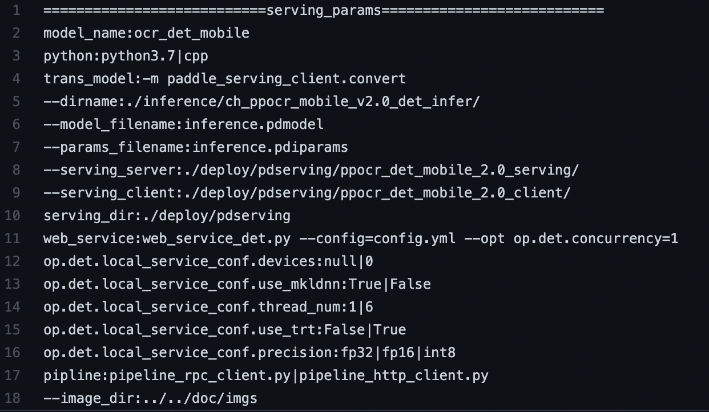

# Linux GPU/CPU 服务化部署测试开发规范

- [1. 总览](#1)
  * [1.1 背景](#11)
  * [1.2 训推一体自动化测试](#12)
  * [1.3 文本检测样板间概览](#13)
- [2. 训推一体规范接入 PaddleServing 预测流程](#2)
  * [2.1 准备数据和环境](#21)
  * [2.2 规范化输出预测日志](#22)
    + [2.2.1 预测日志规范](#221)
    + [2.2.2 接入步骤](#222)
  * [2.3 编写自动化测试代码](#23)
- [3. 附录](#3)
  * [3.1 自动化测试脚本test_serving.sh 函数介绍](#31)
  * [3.2 其他说明](#32)
  
<a name="1"></a>
# 1、总览

<a name="11"></a>
## 1.1 背景
训推一体 CI 机制，旨在监控框架代码更新可能导致的**模型训练、预测报错、性能下降**等问题。本文主要介绍训推一体中**PaddleServing预测链条**的接入规范和监测点，是在[基础链条](todo:add_basic_doc_link)上针对PaddleServing链条的补充说明。

主要监控的内容有：

- 框架更新后，代码仓库的 PaddleServing 预测是否能正常走通；（比如 API 的不兼容升级）
- 框架更新后，代码仓库的 PaddleServing 预测速度是否合理；

为了能监控上述问题，希望把代码仓库的 PaddleServing 预测链条加到框架的 CI 和 CE 中，提升 PR 合入的质量。因此，需要在代码仓库中加入运行脚本（不影响代码仓库正常运行），完成模型的自动化测试。

可以建立的 CI/CE 机制包括：

 1. 不训练，全量数据走通开源模型 PaddleServing 预测，并验证模型预测速度和精度是否符合设定预期；（单模型30分钟内）[保证]

	 a. 保证 Serving 各链条走通，可以正常部署，得到正确预测结果
	 
	 b. 预测资源占用合理（显存）

注：由于 CI 有时间限制，所以在测试的时候需要限制运行时间，所以需要构建一个很小的数据集完成测试。

<a name="12"></a>
## 1.2 训推一体自动化测试

本规范测试的链条如下（其中相邻两个模块之间是两两组合关系），可以根据模型开发规范和模型库需要，适当删减链条。


上图各模块具体测试点如下：

- 服务化模型转换 （必选）
- 部署环境软硬件选型
	- Paddle Inference **（必选）**
		- CPU（Linux **必选** ，MacOS 可选，Windows 可选）
		- GPU（Linux **必选** ，Windows 可选）
	- PaddleLite（可选）
	- XPU（可选）
- Clinet配置（各软硬件环境都要验证）：
	- Python **（必选）** 
	- C++ （可选）
	- Linux GPU上不同batchsize，是否开启TensorRT，不同预测精度（FP32，FP16，INT8）的运行状态 **（必选）**
	-  Linux CPU上不同batchsize，是否开启MKLDNN，不同预测精度（FP32，FP16，INT8）的运行状态 **（必选）**
- 协议配置 **（必选）**：
	- 单模型服务，HTTP协议 （可选）
	- Pipiline服务，HTTP协议（可选）
	- Pipeline服务，RPC协议 **（必选）**

本文档目前只支持了必选链条，可选模块后续完善。

<a name="13"></a>
## 1.3 文本检测样板间概览

在飞桨模型中，以文本检测为例，提供了本规范的样板间，可以跑通1.2章节提到的**所有测试链条**，完成1.1背景部分提到的1种 CI/CE 机制。

PaddleServing 链条测试工具已与基础链条测试集成到一起，位于 PaddleOCR dygraph 分支下的[test_tipc目录](https://github.com/PaddlePaddle/PaddleOCR/tree/dygraph/test_tipc) ，其关键结构如下：
```

test_tipc/
├── common_func.sh
├── configs
│   ├── ppocr_det_model
│   │   ├── model_linux_gpu_normal_normal_serving_python_linux_gpu_cpu.txt # 测试OCR检测模型的参数配置文件
│   ├── xxx
├── docs                              # 各测试流程文档说明
│   ├── test_serving.md              # PaddleServing 部署测试脚本运行说明
│   ├── xxx
├── output
├── prepare.sh                        # 完成训推一体运行所需要的数据和模型下载
├── readme.md                         # 飞桨训推一体认证说明            
├── test_serving.sh                   # PaddleServing 部署启动脚本
├── xxx
...
```

<a name="2"></a>
# 2. 训推一体规范接入 PaddleServing 预测流程
训推一体规范接入包含如下三个步骤，接下来将依次介绍这三个部分。  

 - 准备数据和环境
 - 规范化输出日志
 - 编写自动化测试代码

<a name="21"></a>
## 2.1 准备数据和环境

同标准训推一体测试流程一样，在 prepare.sh 中准备好所需数据和环境，包括：

- 少量预测数据
- inference 预测模型
- Serving 所需 whl 包

以 PaddleOCR 的检测模型为例，使用方式：
```
#                     配置文件路径                                                              运行模式
bash tests/prepare.sh ./tests/model_linux_gpu_normal_normal_serving_python_linux_gpu_cpu.txt 'serving_infer'
```
prepare.sh 具体内容：

```
# 判断预测模式
#!/bin/bash
FILENAME=$1

# MODE be one of ['lite_train_infer' 'whole_infer' 'whole_train_infer', 'infer', 'cpp_infer', 'serving_infer']
MODE=$2

.....

if [ ${MODE} = "serving_infer" ];then
    # 准备serving环境，后期可省略该步骤
    python_name=$(func_parser_value "${lines[2]}")
    wget https://paddle-serving.bj.bcebos.com/chain/paddle_serving_server_gpu-0.0.0.post101-py3-none-any.whl
    ${python_name} -m pip install install paddle_serving_server_gpu-0.0.0.post101-py3-none-any.whl
    ${python_name} -m pip install paddle_serving_client==0.6.1
    ${python_name} -m pip install paddle-serving-app==0.6.3
    # 下载预测模型
    wget -nc  -P ./inference https://paddleocr.bj.bcebos.com/dygraph_v2.0/ch/ch_ppocr_mobile_v2.0_det_infer.tar
    # 下载预测数据
    wget -nc -P ./inference https://paddleocr.bj.bcebos.com/dygraph_v2.0/test/ch_det_data_50.tar
    cd ./inference && tar xf ch_ppocr_mobile_v2.0_det_infer.tar &&  tar xf ch_det_data_50.tar && cd ../
fi
```

<a name="22"></a>
## 2.2 规范化输出预测日志
<a name="221"></a>
### 2.2.1 预测日志规范
（1）背景
类似于 python 预测等基础测试链条，PaddleServing 预测链条也需要规范不同代码仓库中 paddle inference 预测输出的格式，方便统一自动化测试。由于PaddleServing启动的特殊性，该链条只监控预测正确性，性能数据暂不进行监控。

Serving测试要求规范输出预测结果及以下信息：

- 运行的硬件，CPU、GPU、XPU、Lite
- 运行的基本配置信息，是否开启了IR 优化、TRT、MKLDNN，以及具体使用的线程数
- 运行的模型名称
- 运行的数据信息，包括 batch size，数据量
- 运行的模式信息，是否开启安全网管、模型加解密、协议配置、Client 配置
- 图片的预测结果

<a name="222"></a>
### 2.2.2 接入步骤

PaddleServing 测试链条无需接入 AutoLog 工具包，注意日志导出名称需符合规范，具体在编写自动化测试代码中说明。


<a name="23"></a>
## 2.3 编写自动化测试代码

如果已经完成 python 预测链条的接入，那么 PaddleServing 链条接入是类似的。

自动化测试脚本包括三个部分，分别是运行脚本`test_serving.sh`，参数文件`model_linux_gpu_normal_normal_serving_python_linux_gpu_cpu.txt`，数据模型准备脚本`prepare.sh`。理论上只需要修改`model_linux_gpu_normal_normal_serving_python_linux_gpu_cpus.txt`和`prepare.sh`就可以完成自动化测试，本节将详细介绍如何修改`model_linux_gpu_normal_normal_serving_python_linux_gpu_cpu.txt`，完成 PaddleServing 预测测试。运行脚本test_serving.sh将会在附录中详细介绍。

按如下方式在参数文件`model_linux_gpu_normal_normal_serving_python_linux_gpu_cpu.txt`中添加 PaddleServing 预测部分参数：


参数说明：

|行号 | 参数 | 参数介绍 | 
|---|---|---|
|1  | model_name | 模型名称 |
|2 | python | python版本 |
|3 | trans\_model: -m paddle\_serving\_client.convert | serving 模型转化命令|
|4 | --dirname:./inference/ch\_ppocr\_mobile\_v2.0\_det\_infer/ | inference 模型保存路径 |
|5 | --model_filename:inference.pdmodel| pdmodel 文件名 |
|6 | --params_filename:inference.pdiparams | pdiparams 文件名 |
|7 | --serving\_server:./deploy/pdserving/ppocr\_det\_mobile\_2.0\_serving/ | 转换出的 serving 模型目录|
|8 | --serving_client:./deploy/pdserving/ppocr_det_mobile_2.0_client/ | 转换出的 client 模型目录 | 
|9 | serving_dir:./deploy/pdserving | serving 部署的工作目录 |
|10 | web_service:web_service_det.py --config=config.yml --opt op.det.concurrency=1 | 启动serving服务，配置参数为通过工作目录下的config.yml |
|11 | op.det.local_service_conf.devices:null \| 0 | 设置Serving服务的启动设备，null：cpu启动，0：在0号gpu卡上启动 |
|12 | op.det.local_service_conf.use_mkldnn:True\|False | 设置是否开启mkldnn | 
|13 | op.det.local_service_conf.thread_num:1\|6  | 设置CPU线程数 |
|14 | op.det.local_service_conf.use_trt:False\|True | 设置是否开启TensorRT| 
|15 | op.det.local_service_conf.precision:fp32\|fp16\|int8 | 设置开启TRT后的预测精度 | 
|16 | pipeline:pipeline_rpc_client.py \| pipeline_http_client.py | 启动pipeline预测命令 | 
|17| --image_dir=../../doc/imgs | 预测图片路径 |

<a name="3"></a>
# 3. 附录
<a name="31"></a>
## 3.1 自动化测试脚本test_serving.sh 函数介绍
PaddleServing 预测核心函数：

- func_serving()：执行 Serving 预测的函数，如果是 GPU 上，会测试是否开启 TRT 和不同精度下的情况；如果是 CPU，会测试是否开启 mkldnn，不同 CPU 线程数。另外，如果是量化模型，则仅测试 CPU+mkldnn 和 GPU+trt+int8 的组合。 由于 Serving 的特性，目前只支持bs=1的预测。

以下 function 和 python 预测链条功能一致。

- func_parser_key() ：解析params.txt中：前的部分

- func_parser_value() ：解析params.txt中：后的部分

- func_set_params()  ：会返回 key=value 的字符串，用与组建参数命令，如果key或者value为null，则返回空字符，即这个参数不会生效

- func_parser_params() ：为了解析和测试模式 MODE 相关的参数，目前只用来解析 epoch 和 batch size 参数

- status_check() ：状态检查函数，获取上条指令运行的状态，如果是0，则运行成功，如果是其他则运行失败，失败和成功的指令都会存放在 results.log 文件中


<a name="32"></a>
## 3.2 其他说明

test_serving.sh 是兼容性修改，理论上所有代码仓库用一套代码，test_serving.sh 中也做了很多兼容性的改动，如果还有哪些兼容性的问题需要改进，包括使用问题可以提交Issue。
